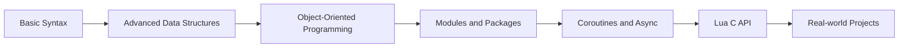

# 7-Day Advanced Lua Study Plan

## Learning Objectives
By the end of this study plan, you will master:
- Advanced Lua data structures and table operations
- Object-Oriented Programming in Lua
- Functional programming and closures
- Module and package management
- Coroutines and asynchronous programming
- Lua C API and FFI
- Real-world applications

## Prerequisites

### Required Knowledge
- [ ] Basic Lua syntax (variables, loops, conditionals, functions, etc.)
- [ ] Basic table operations
- [ ] Fundamentals of functions and closures

### Development Environment
- [ ] Install [Lua 5.4](https://www.lua.org/download.html)
- [ ] Install [VS Code](https://code.visualstudio.com/)
- [ ] Install [Lua Language Server](https://marketplace.visualstudio.com/items?itemName=sumneko.lua) extension
- [ ] Install [Lua Debug](https://marketplace.visualstudio.com/items?itemName=actboy168.lua-debug) debugger
- [ ] Install [Git](https://git-scm.com/)

### Verify Installation
```bash
lua -v
code --version
git --version
```

## Day 1: Advanced Data Structures and Tables

### Morning (09:00-12:00): Deep Dive into Tables
- [ ] Table operations (insertion, deletion, sorting, concatenation)
- [ ] Nested tables and complex data structures
- [ ] Table serialization and deserialization
- [ ] Introduction to metatables

### Afternoon (14:00-18:00): Hands-on Exercises
1. [ ] Implement a JSON parser/generator using Lua tables
   - Goal: Handle basic JSON structures
   - Time: 1.5 hours
   - Hint: Start with simple objects and arrays

2. [ ] Implement a priority queue using tables
   - Goal: Support insertion and popping highest priority element
   - Time: 1 hour
   - Hint: Use tables to store elements and keep them ordered

3. [ ] Build a simple object system using tables and metatables
   - Goal: Support object creation, method calls, and inheritance
   - Time: 1.5 hours

### Evening (20:00-21:30): Reading and Review
- [ ] Read [Lua 5.4 Reference Manual - Tables and Metatables](https://www.lua.org/manual/5.4/manual.html#2.4)
- [ ] Read "Programming in Lua" Chapter 5 (Tables) and Chapter 13 (Metatables)
- [ ] Complete study log:
  - 3 key points learned today
  - Problems encountered and solutions
  - Tomorrow's study plan

### Code Example: Metatable Basics
```lua
-- Simple metatable example
local mt = {}
function mt.__add(a, b)
    return {value = a.value + b.value}
end

local a = {value = 10}
local b = {value = 20}
setmetatable(a, mt)
setmetatable(b, mt)

local c = a + b
print(c.value)  -- Output: 30
```

## Day 2: Object-Oriented Programming in Lua

### Morning (09:00-12:00): OOP Concepts
- [ ] Implement classes and objects using tables
- [ ] Inheritance patterns (prototype-based, class-based)
- [ ] Polymorphism implementation
- [ ] Encapsulation and private members

### Afternoon (14:00-18:00): Hands-on Exercises
1. [ ] Create a class hierarchy (Shape → Circle, Rectangle)
   - Goal: Implement base shape classes with area and perimeter calculations
   - Time: 1.5 hours

2. [ ] Implement method overriding and multiple inheritance
   - Goal: Create a class system supporting multiple inheritance
   - Time: 1.5 hours
   - Hint: Use metatables and `__index`

3. [ ] Build a small object-oriented system
   - Goal: Implement an entity system (Entity, Player, Enemy) for games
   - Time: 1 hour

### Evening (20:00-21:30): Reading and Review
- [ ] Read "Programming in Lua" Chapter 16 (Object-Oriented Programming)
- [ ] Study OOP implementations in Lua frameworks (e.g., LÖVE, Corona)
- [ ] Complete study log

### Code Example: Class Implementation
```lua
-- Simple class implementation
local Class = {}
Class.__index = Class

function Class:new()
    local instance = {}
    setmetatable(instance, self)
    return instance
end

-- Inheritance
function Class:extend()
    local subclass = {}
    self.__index = self
    setmetatable(subclass, self)
    return subclass
end

-- Usage example
local Shape = Class:extend()
function Shape:area()
    return 0
end

local Circle = Shape:extend()
function Circle:new(radius)
    local instance = Shape.new(self)
    instance.radius = radius
    return instance
end

function Circle:area()
    return math.pi * self.radius * self.radius
end
```

## Day 3: Functional Programming and Closures

### Morning: Functional Programming Concepts
- First-class functions
- Higher-order functions
- Closures and lexical scoping
- Currying and partial application

### Afternoon: Exercises
1. Implement map, filter, and reduce functions
2. Create a memoization system using closures
3. Build a simple event system with callbacks

### Evening: Reading
- Programming in Lua, Chapter 6 (Functions) and Chapter 7 (Iterators and Closures)
- Explore functional programming patterns in Lua

### Code Example: Functional Programming
```lua
-- Higher-order function example
function map(tbl, f)
    local t = {}
    for k,v in pairs(tbl) do
        t[k] = f(v)
    end
    return t
end

-- Closure example
function createCounter()
    local count = 0
    return function()
        count = count + 1
        return count
    end
end

-- Currying example
function add(x)
    return function(y)
        return x + y
    end
end

-- Usage examples
local numbers = {1, 2, 3, 4}
local doubled = map(numbers, function(x) return x * 2 end)

local counter = createCounter()
print(counter())  -- Output: 1
print(counter())  -- Output: 2

local add5 = add(5)
print(add5(3))    -- Output: 8
```

## Day 4: Modules, Packages, and Project Structure

### Morning: Module System
- Creating and using modules
- Module loading mechanisms
- Package management
- Project organization best practices

### Afternoon: Exercises
1. Refactor existing code into proper modules
2. Create a small library with multiple modules
3. Implement a plugin system using modules

### Evening: Reading
- Lua 5.4 Reference Manual section on Modules
- Programming in Lua, Chapter 15 (Modules and Packages)

### Code Example: Module Implementation
```lua
-- File: mymodule.lua
local M = {}  -- Module table

local privateVar = "I'm private"

function M.publicFunction()
    return "This is a public function"
end

local function privateFunction()
    return "This is private"
end

function M.usingPrivate()
    return privateFunction()
end

return M

-- File: main.lua
local mymodule = require "mymodule"
print(mymodule.publicFunction())  -- Works
print(mymodule.usingPrivate())    -- Works
-- print(mymodule.privateFunction())  -- Error: privateFunction is not accessible
```

## Day 5: Coroutines and Asynchronous Programming

### Morning: Coroutines
- Coroutine basics (create, resume, yield)
- State management with coroutines
- Error handling in coroutines
- Asynchronous programming patterns

### Afternoon: Exercises
1. Implement a simple task scheduler using coroutines
2. Create a cooperative multitasking system
3. Build an asynchronous HTTP client using coroutines

### Evening: Reading
- Lua 5.4 Reference Manual section on Coroutines
- Programming in Lua, Chapter 9 (Coroutines)

### Code Example: Coroutines
```lua
-- Simple coroutine example
local function producer()
    for i = 1, 3 do
        print("Producing", i)
        coroutine.yield(i)
    end
    return "done"
end

local co = coroutine.create(producer)

while true do
    local success, value = coroutine.resume(co)
    if not success then
        print("Coroutine finished")
        break
    end
    print("Consumed", value)
end
```

## Day 6: Lua C API and FFI

### Morning: Lua C API
- Extending Lua with C
- Creating Lua bindings for C libraries
- Performance considerations
- LuaJIT FFI introduction

### Afternoon: Exercises
1. Extend your existing C module with new functions
2. Create bindings for a simple C library
3. Benchmark Lua vs C implementations of algorithms

### Evening: Reading
- Lua 5.4 Reference Manual sections on C API
- Programming in Lua, Chapter 24-26 (C API)

### Code Example: Lua C API (simplified)
```c
// File: mylib.c
#include <lua.h>
#include <lauxlib.h>
#include <lualib.h>

// C function to be called from Lua
static int l_myfunction(lua_State *L) {
    double num = luaL_checknumber(L, 1);
    lua_pushnumber(L, num * 2);
    return 1;  // Number of return values
}

// Library registration
static const luaL_Reg mylib[] = {
    {"myfunction", l_myfunction},
    {NULL, NULL}  // Sentinel
};

// Library entry point
int luaopen_mylib(lua_State *L) {
    luaL_newlib(L, mylib);
    return 1;
}
```

### Code Example: LuaJIT FFI
```lua
-- Using FFI to call C functions directly
local ffi = require("ffi")

-- Declare C functions and types
ffi.cdef[[
    int printf(const char *fmt, ...);
    double sqrt(double x);
]]

-- Call C functions
ffi.C.printf("Hello from C!\n")
local x = ffi.C.sqrt(16.0)
print(x)  -- Output: 4.0
```

## Day 7: Real-World Applications and Advanced Topics

### Morning: Advanced Topics
- Debugging and profiling Lua code
- Performance optimization techniques
- Sandboxing and security considerations
- Embedding Lua in applications

### Code Example: Debugging and Profiling
```lua
-- Simple debug hook example
local function debugHook(event, line)
    print("Event:", event, "Line:", line)
    -- Get stack trace
    for i = 1, 10 do
        local info = debug.getinfo(i, "Sl")
        if not info then break end
        print(string.format("%s:%d in function '%s'",
            info.short_src, info.currentline,
            info.name or "(main)"))
    end
end

-- Set debug hook
debug.sethook(debugHook, "l")

-- Simple profiler example
local profile = {}
local function startProfile()
    debug.sethook(function()
        local info = debug.getinfo(2, "nS")
        local func = info.name or "unknown"
        profile[func] = (profile[func] or 0) + 1
    end, "c")
end

local function stopProfile()
    debug.sethook()
    for func, count in pairs(profile) do
        print(func, count)
    end
end
```

### Afternoon: Project Work
1. Start a small real-world project combining multiple concepts
2. Implement a domain-specific language (DSL) in Lua
3. Create a game prototype or automation tool using Lua

### Code Example: Simple DSL Implementation
```lua
-- Simple configuration DSL example
local config = {}

function config.setup(settings)
    -- Process configuration settings
    for k, v in pairs(settings) do
        print(string.format("Setting %s = %s", k, tostring(v)))
    end
end

-- DSL function
function config.define(name, options)
    return function(...)
        print("Defining", name, "with options:", ...)
        -- Process options
    end
end

-- Example usage of the DSL
local define = config.define

config.setup {
    debug = true,
    environment = "development"
}

define "user" {
    name = "required",
    email = "required|email",
    age = "number|min:18"
}

-- This creates a simple validation system
function validate(schema, data)
    local errors = {}
    -- Implementation would validate data against schema
    return #errors == 0, errors
end
```

### Evening: Review and Planning
- Review key concepts from the week
- Identify areas for further study
- Plan next steps for Lua mastery

## Learning Resources

### Recommended Books
- [ ] ["Programming in Lua" 4th Edition](https://www.lua.org/pil/)
- [ ] ["Lua Programming Gems"](https://www.lua.org/gems/)
- [ ] ["Lua Quick Reference"](https://lua.org/pil/contents.html)

### Online Resources
- [ ] [Lua 5.4 Reference Manual](https://www.lua.org/manual/5.4/) (Required)
- [ ] [Lua Users Wiki](http://lua-users.org/wiki/)
- [ ] [Learn Lua in Y Minutes](https://learnxinyminutes.com/docs/lua/)
- [ ] [Lua Style Guide](https://github.com/Olivine-Labs/lua-style-guide)

### Project References
- [ ] [LÖVE Game Framework](https://love2d.org/)
- [ ] [Redis Lua Scripting](https://redis.io/commands/eval/)
- [ ] [Neovim Configuration](https://github.com/nvim-lua/kickstart.nvim)
- [ ] [World of Warcraft AddOns](https://wowpedia.fandom.com/wiki/World_of_Warcraft_API)

### Learning Path


### Progress Tracking
| Day | Topic | Status | Notes |
|-----|-------|--------|-------|
| 1 | Advanced Data Structures | ⬜ Not Started | |
| 2 | OOP in Lua | ⬜ Not Started | |
| 3 | Functional Programming | ⬜ Not Started | |
| 4 | Modules and Packages | ⬜ Not Started | |
| 5 | Coroutines and Async | ⬜ Not Started | |
| 6 | Lua C API | ⬜ Not Started | |
| 7 | Project | ⬜ Not Started | |

### Study Tips
1. Maintain 3-4 hours of focused study time daily
2. Try to solve problems independently before looking up solutions
3. Regularly review previously learned material
4. Contribute to open source or start personal projects
5. Join Lua communities (official forum, r/lua on Reddit, etc.)

## Conclusion
This study plan is designed to help you systematically master the Lua programming language. Adjust the pace according to your needs, and remember that understanding concepts is more important than just completing exercises. Happy learning!

> Tip: Use `lua -i` for quick testing in interactive mode, and `luac -p your_code.lua` to check syntax errors.

## Daily Learning Routine

### 1. Morning (09:00-12:00)
- [ ] Read and understand the day's topics
- [ ] Take notes on key concepts and code examples
- [ ] Complete small exercises to verify understanding

### 2. Afternoon (14:00-18:00)
- [ ] Work on hands-on projects
- [ ] Use VS Code debugger to troubleshoot issues
- [ ] Add detailed comments to your code

### 3. Evening (20:00-21:30)
- [ ] Read recommended materials
- [ ] Review the day's content
- [ ] Complete study log
- [ ] Commit code to Git repository

### 4. Code Commit Convention
```
git add .
git commit -m "feat(day1): Implement JSON parser and priority queue

- Add basic JSON parsing functionality
- Implement priority queue data structure
- Fix empty table handling bug"
```

### 5. Study Log Template
```markdown
## Day X Study Log - [Date]

### Topics Covered
- [ ] Topic 1
- [ ] Topic 2

### Challenges Faced
1. Description of the issue
   - Solution approach

### Plan for Tomorrow
1. Task 1
2. Task 2

### Key Takeaways
- Takeaway 1
- Takeaway 2
```

## Next Steps After Completion

- Contribute to open-source Lua projects
- Create your own Lua library or framework
- Explore LuaJIT for performance-critical applications
- Learn a Lua framework like LÖVE, Lapis, or Torch

